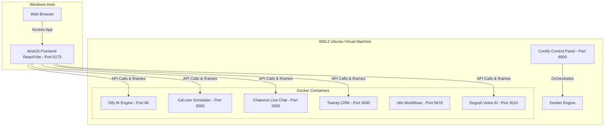

# AiraOS Local Stack Setup & Deployment Guide

This guide describes how to set up the entire self-hosted stack (**Dify**, **Cal.com**, **Chatwoot**, **Twenty CRM**, and **Dograh**) locally on a Windows laptop using **WSL2 (Windows Subsystem for Linux)**, **Ubuntu**, and **Coolify** (or Docker Compose), and connect them to the **AiraOS** React frontend.

---

## Architecture Overview



---

## Step 1: Install WSL2 & Ubuntu

Since Docker containers run natively on Linux, setting up WSL2 on Windows provides the best performance and compatibility.

1. Open **PowerShell** or **Command Prompt** as Administrator.
2. Run the WSL installation command:
   ```powershell
   wsl --install -d Ubuntu
   ```
3. Once the installation completes, **restart your laptop**.
4. After restarting, a console window will open automatically asking you to configure a **Unix Username** and **Password** for your new Ubuntu distribution. Write these down!

---

## Step 2: Install Docker inside WSL2 Ubuntu

We recommend installing Docker directly inside Ubuntu to keep the development stack isolated from Windows.

1. Open your Ubuntu terminal (search "Ubuntu" in the Windows start menu).
2. Update the package database:
   ```bash
   sudo apt update && sudo apt upgrade -y
   ```
3. Install Docker:
   ```bash
   curl -fsSL https://get.docker.com -o get-docker.sh
   sudo sh get-docker.sh
   ```
4. Allow your user to run Docker commands without `sudo`:
   ```bash
   sudo usermod -aG docker $USER
   ```
5. Restart your terminal or run:
   ```bash
   newgrp docker
   ```
6. Verify Docker is running:
   ```bash
   docker --version
   docker ps
   ```

---

## Step 3: Install Coolify on WSL2 Ubuntu

Coolify is an open-source, self-hosted Heroku/Netlify alternative. It orchestrates Docker containers, configures Traefik reverse proxy, issues local SSLs, and maps custom ports.

1. In the Ubuntu terminal, run the Coolify installer script:
   ```bash
   curl -fsSL https://cdn.coollabs.io/coolify/install.sh | bash
   ```
2. Wait for the installation to finish (usually takes 2-3 minutes).
3. Once completed, open your web browser on Windows and navigate to:
   ```
   http://localhost:8000
   ```
4. Create your admin account (username and password).
5. In the Coolify setup wizard, select **Local Host** as your server. Coolify will connect to your local Docker daemon inside WSL2.

---

## Step 4: Deploy services in Coolify / Docker Compose

You can deploy the tools using Coolify's built-in service templates or launch them directly via Docker Compose.

### 1. Dify (AI Chat & Knowledge RAG Engine)
* **Via Coolify:** Go to **Services** -> **New** -> Select **Dify** -> click **Deploy**.
* **Ports mapped:** Port `80` (Dify frontend) and `5001` (Dify API).
* **OpenAI API Key Connection:** In the Dify console (`http://localhost:80`):
  1. Set up an Admin Account.
  2. Navigate to **Settings -> Model Providers**.
  3. Locate **OpenAI** and click **Setup**.
  4. Paste your **OpenAI API Key** (e.g. `sk-proj-...`). No local LLM is needed.

### 2. Chatwoot (Live Chat & Customer Inbox)
* **Via Coolify:** Go to **Services** -> **New** -> Select **Chatwoot** -> click **Deploy**.
* **Ports mapped:** Port `3000` (Chatwoot console).
* **Configuration:** 
  1. Access `http://localhost:3000` and create an agent profile.
  2. Under **Inboxes**, create a new **Website** inbox channel.
  3. Copy the **inbox token** (visible in the widget snippet: `https://chatwoot.yourdomain.com/widget/TOKEN`).

### 3. Cal.com (Appointment Scheduling)
* Cal.com can be deployed using the Coolify template or a standard Docker Compose.
* **Ports mapped:** Port `3000` (or `3002` to avoid collisions).
* **Configuration:** Set up your booking team slot and copy your booking page URL slug (e.g., `http://localhost:3000/reception/30min`).

### 4. Twenty CRM (Relationship & Pipeline Management)
* **Via Coolify:** Select **Services** -> **New** -> **Twenty CRM** -> click **Deploy**.
* **Ports mapped:** Port `3000` (or custom mapped to `8080`).
* **API Key:** Navigate to Twenty's Settings -> **API Keys**, generate a new API token to authenticate requests.

### 5. n8n (Workflow Automation Engine)
* **Via Coolify:** Select **Services** -> **New** -> Select **n8n** -> click **Deploy**.
* **Ports mapped:** Port `5678` (n8n console).
* **Configuration:**
  1. Access the console at `http://localhost:5678` and configure your credentials.
  2. In AiraOS, when you enter this URL in the integration settings, it unlocks the **Open Visual Designer** link directly under the **Automation Workflows** tab.
  3. Under **Settings -> API Keys**, generate a new token to connect your local flows.

### 6. Dograh (Open-Source Voice AI Platform)
Dograh (now Voxfra) runs best via Docker Compose. You can run it inside WSL2 Ubuntu using the docker command:

1. Create a workspace directory inside Ubuntu:
   ```bash
   mkdir -p ~/dograh && cd ~/dograh
   ```
2. Download the official `docker-compose.yaml` file:
   ```bash
   curl -o docker-compose.yaml https://raw.githubusercontent.com/dograh-hq/dograh/main/docker-compose.yaml
   ```
3. Boot the stack using your OpenAI API Key directly:
   ```bash
   REGISTRY=ghcr.io/dograh-hq ENABLE_TELEMETRY=true OPENAI_API_KEY=your_openai_api_key docker compose up -d
   ```
4. Verify the server is running by accessing the web portal:
   ```
   http://localhost:3010
   ```
   *(Ensure port `3010` is mapped in the compose file)*

---

## Step 5: Connect Services to AiraOS React Frontend

Now that all services are running locally inside WSL2 Docker containers, you need to plug their endpoints into AiraOS.

1. Run the AiraOS frontend locally on Windows:
   ```powershell
   npm run dev
   ```
2. Open AiraOS in your browser: `http://localhost:5173`.
3. Log in or append `?role=superadmin#admin` to the URL to access the **Super Admin Platform Control** dashboard:
   ```
   http://localhost:5173/?role=superadmin#admin
   ```
4. Navigate to the **System Infrastructure** tab.
5. In the **Coolify Integration Manager (VPS Service Mapping)** form, fill in your local port-mapped endpoints:

   | Service | Endpoint URL | API Key / Token |
   | :--- | :--- | :--- |
   | **Dify AI Engine** | `http://localhost:80` | *Your Dify App API Key* |
   | **Chatwoot Live Chat** | `http://localhost:3000` | *Your Website Channel Inbox Token* |
   | **n8n Workflow** | `http://localhost:5678` | *n8n API Key (if using workflows)* |
   | **Cal.com Scheduler** | `http://localhost:3002/reception/30min` | *N/A (Booking Page Slug)* |
   | **Twenty CRM** | `http://localhost:8080` | *Twenty API Token* |
   | **Dograh Voice AI** | `http://localhost:3010` | *Dograh JWT/Auth Token* |
   | **OpenAI Integration** | *N/A* | `sk-proj-your_actual_openai_key` |

6. Click **Save Integration Mapping**.
7. The dashboard stores these mappings in local storage and instantly switches AiraOS views from mock/simulated interfaces to rendering your **live local microservice connections** (such as loading the Cal.com iframe in the scheduler, referencing Chatwoot live chats, and displaying the Dograh Voice status as **Online**).

---

## Troubleshooting Local WSL2 Port Forwarding

By default, WSL2 forwards all ports mapped to `0.0.0.0` or `127.0.0.1` inside Ubuntu directly to Windows `localhost`. If a port is not accessible from Windows, run this diagnostic in Windows PowerShell:

1. Retrieve the WSL VM IP Address:
   ```powershell
   wsl hostname -I
   ```
   *(e.g., `172.24.89.5`)*
2. Access the service in Windows using that IP address (e.g., `http://172.24.89.5:8000` for Coolify).
3. If necessary, bind ports to all interfaces (`0.0.0.0`) in your docker configs or setup port forwarding rules using netsh:
   ```powershell
   netsh interface portproxy add v4tov4 listenport=8000 listenaddress=0.0.0.0 connectport=8000 connectaddress=172.24.89.5
   ```
